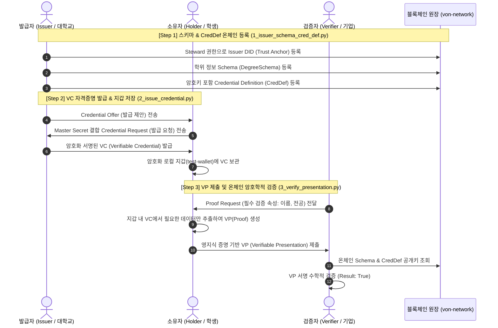
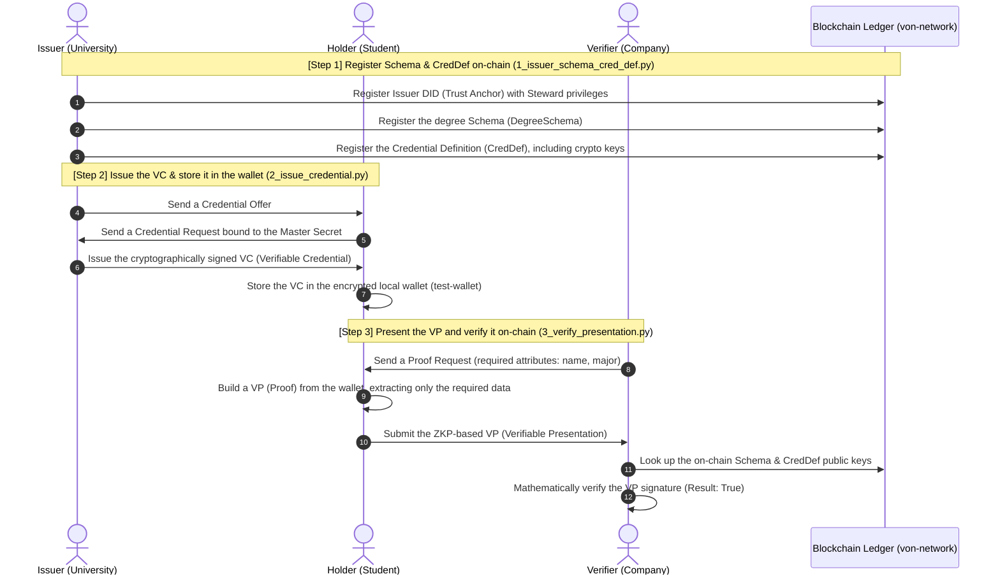

# Hyperledger Indy 기반 자기주권신원(SSI) DID/VC/VP 자격증명 시스템


Hyperledger Indy 블록체인 네트워크(`von-network`)를 활용하여 **자기주권신원(Self-Sovereign Identity, SSI)**의 핵심인 **DID(탈중앙 식별자)** 생성, **VC(검증 가능한 자격증명)** 발급, 그리고 **VP(검증 가능한 프레젠테이션)** 영지식 증명(ZKP) 검증 라이프사이클을 구현한 프로젝트입니다.

---

## 프로젝트 핵심 요소

1. **온체인 신뢰 앵커(Trust Anchor) 등록 및 트랜잭션 검증**
   - 네트워크 최고 관리자(Steward) 권한을 활용하여 Issuer(발급자) DID를 원장에 등록
   - 자격증명 구조 정의서인 **Schema** 및 **Credential Definition (CredDef)** 블록체인 상에 영구 기록
2. **개인정보 보호 중심의 VC 발급**
   - Holder(소유자)의 고유 비밀값(Master Secret) 결합을 통해 타인에 의한 명의 도용 차단
   - 암호화된 로컬 지갑(Wallet)에 자격증명 수령 및 보관
3. **영지식 증명(ZKP) 기반 VP 검증**
   - Verifier(검증자)의 Proof Request 조건에 맞는 최소 정보만 선택적으로 공개(Selective Disclosure)
   - 원본 VC나 개인키 노출 없이 블록체인의 온체인 공개키 정보를 통한 암호학적 서명 검증 수행

---

##  시스템 아키텍처 & 라이프사이클 흐름



---

##  기술 스택 (Tech Stack)

| 구분 | 사용 기술 |
|---|---|
| **Ledger Network** | Hyperledger Indy, `von-network` (4 Node BFT Consensus) |
| **SDK & Core** | Python 3, `python3-indy`, `indy-vdr` |
| **Crypto & Storage** | Zero-Knowledge Proof (ZKP), Libsodium, RocksDB |
| **Container & OS** | Docker Desktop, Apple Silicon (M2 ARM64 Native Containerization) |

---

##  트러블슈팅 및 환경 최적화 (Problem Solving)

> **Apple Silicon (M2 Mac) x86_64 에뮬레이션 블록킹 문제 해결**
> - **문제 상황**: 기존 x86_64 기반 `bcgov/von-image` 실행 시, QEMU/Rosetta 에뮬레이션 환경에서 Indy Plenum consensus 이벤트 루프가 교착 상태(Freeze)에 빠져 노드 간 통신이 중단되는 문제 발생.
> - **원인 분석**: C/Python 저수준 `epoll` 및 ZMQ 소켓 통신 시 64비트 메세지 시그널이 x86_64 에뮬레이터 레이어에서 드랍됨을 규명.
> - **해결 방안**: Dockerfile 베이스 이미지를 Apple Silicon 네이티브 `snel/von-image:node-1.12-4-arm64`로 교체하고, `indy_vdr~=0.4.0` arm64 휠 의존성을 재구성하여 에뮬레이션 레이어 없이 **M2 칩셋에서 ARM64 네이티브로 100% 구동**되도록 최적화 완료.

---

##  실행 가이드 (Quick Start)

### 사전 조건 (Prerequisites)
- Docker Desktop 실행 (`von-network` 가 구동 중이어야 함)

### 1단계: 저장소 클론
```bash
git clone https://github.com/Andrewpark-hub/indy-did-credential-demo.git
cd indy-did-credential-demo
```

### 2단계: 실습 파이프라인 단계를 순서대로 실행
```bash
# Step 1: Issuer Schema 및 CredDef 원장 등록
./run.sh 1

# Step 2: Holder VC 발급 및 암호화 지갑 저장
./run.sh 2

# Step 3: Verifier VP 제출 및 온체인 영지식 검증
./run.sh 3
```

---

##  파일 구조 (Directory Structure)

```text
├── 1_issuer_schema_cred_def.py   # Step 1: 스키마 및 CredDef 온체인 등록 스크립트
├── 2_issue_credential.py          # Step 2: VC 자격증명 발급 및 지갑 저장 스크립트
├── 3_verify_presentation.py       # Step 3: VP 제출 및 영지식 증명 검증 스크립트
├── pool_transactions_genesis      # 로컬 노드 연결 제네시스 트랜잭션 파일
├── run.sh                         # 도커 컨테이너 기반 실습 통합 실행 파이프라인
└── .idea/runConfigurations/       # 파이Charm원클릭 실행 구성 설정을 위한 메타데이터
```

---
---

# 🔗 Self-Sovereign Identity (SSI) Credential System on Hyperledger Indy — DID / VC / VP

*English version — the Korean original is above.*


A project that implements the full **Self-Sovereign Identity (SSI)** lifecycle on a Hyperledger Indy blockchain network (`von-network`): creating a **DID (Decentralized Identifier)**, issuing a **VC (Verifiable Credential)**, and verifying a **VP (Verifiable Presentation)** through zero-knowledge proof (ZKP).

---

## 📌 Key Components

1. **On-chain Trust Anchor registration and transaction verification**
   - Registers the Issuer DID on the ledger using Steward (network administrator) privileges
   - Writes the **Schema** and **Credential Definition (CredDef)** — the structural definition of a credential — permanently onto the blockchain
2. **Privacy-preserving VC issuance**
   - Binds the Holder's unique **Master Secret** into the credential, blocking impersonation by anyone else
   - Receives and stores the credential in an encrypted local wallet
3. **ZKP-based VP verification**
   - **Selective disclosure**: only the minimum attributes required by the Verifier's Proof Request are revealed
   - Cryptographic signature verification against the on-chain public keys, without ever exposing the original VC or a private key

---

## 🔄 System Architecture & Lifecycle Flow



---

## 🛠️ Tech Stack

| Category | Technology |
|---|---|
| **Ledger Network** | Hyperledger Indy, `von-network` (4-node BFT consensus) |
| **SDK & Core** | Python 3, `python3-indy`, `indy-vdr` |
| **Crypto & Storage** | Zero-Knowledge Proof (ZKP), Libsodium, RocksDB |
| **Container & OS** | Docker Desktop, Apple Silicon (M2, ARM64-native containerization) |

---

## ⚡ Troubleshooting & Environment Optimization

> **Resolving an x86_64 emulation deadlock on Apple Silicon (M2 Mac)**
> - **Problem**: Running the existing x86_64-based `bcgov/von-image` under QEMU/Rosetta emulation caused the Indy Plenum consensus event loop to freeze, cutting off communication between nodes.
> - **Root cause**: I traced it to 64-bit message signals being dropped by the x86_64 emulation layer during low-level C/Python `epoll` and ZMQ socket communication.
> - **Fix**: Replaced the Dockerfile base image with the Apple Silicon-native `snel/von-image:node-1.12-4-arm64` and rebuilt the `indy_vdr~=0.4.0` arm64 wheel dependencies, so the stack now runs **100% ARM64-native on the M2 chipset** with no emulation layer.

---

## 🚀 Quick Start

### Prerequisites
- Docker Desktop running (`von-network` must be up)

### Step 1: Clone the repository
```bash
git clone https://github.com/Andrewpark-hub/indy-did-credential-demo.git
cd indy-did-credential-demo
```

### Step 2: Run the pipeline stages in order
```bash
# Step 1: Register the Issuer Schema and CredDef on the ledger
./run.sh 1

# Step 2: Issue the Holder's VC and store it in the encrypted wallet
./run.sh 2

# Step 3: Submit the Verifier's VP and verify it on-chain with ZKP
./run.sh 3
```

---

## 📂 Directory Structure

```text
├── 1_issuer_schema_cred_def.py   # Step 1: Registers the Schema and CredDef on-chain
├── 2_issue_credential.py          # Step 2: Issues the VC and stores it in the wallet
├── 3_verify_presentation.py       # Step 3: Submits the VP and verifies the zero-knowledge proof
├── pool_transactions_genesis      # Genesis transaction file for connecting to the local nodes
├── run.sh                         # Unified pipeline runner on top of Docker containers
└── .idea/runConfigurations/       # PyCharm one-click run configuration metadata
```
